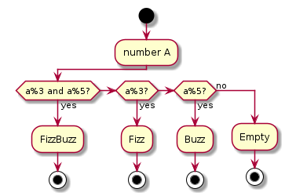

# Go basic template

This repository contains a basic template for Go projects with a simple FizzBuzz problem.
To run this project Docker installation is required.

## Makefile

#### FizzBuzz example

## Makefile

Use `Makefile` to run the project. To list all available options run `make`.

## Instructions

- Run make up to run the project.